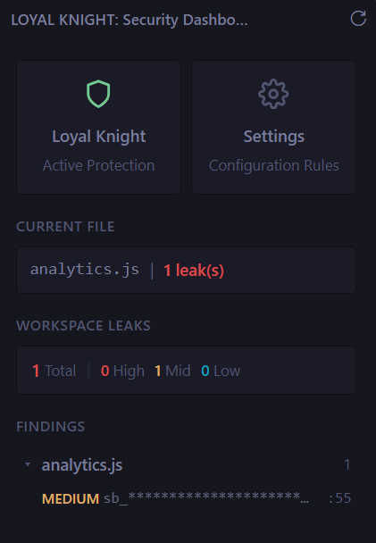

<div align="center">
  <h1>🛡️ Loyal Knight</h1>
  <p><strong>Next-Generation Local API Leak & Secret Lifecycle Security for VS Code</strong></p>
  
  [](https://marketplace.visualstudio.com/items?itemName=singularity-dudes.loyal-knight)
  [](https://marketplace.visualstudio.com/items?itemName=singularity-dudes.loyal-knight)
  [](LICENSE)
  [](https://marketplace.visualstudio.com/items?itemName=singularity-dudes.loyal-knight)
</div>

---

**Loyal Knight** is an enterprise-grade, zero-trust Visual Studio Code extension engineered to prevent secret leaks and manage credential lifecycles seamlessly. Operating entirely within your local environment, it acts as a proactive security guardian—ensuring that API keys, tokens, and passwords are never inadvertently hardcoded or committed to version control.

By performing **100% local, offline, and real-time** security analysis, Loyal Knight guarantees that your proprietary source code and sensitive credentials never leave your machine. Experience absolute privacy, sub-millisecond performance, and zero reliance on external cloud services.

<div align="center">
  
  <br>
  <p><em>Comprehensive workspace vulnerability insights powered by a sleek, centralized dashboard.</em></p>
</div>

---

## ⚡ Why Loyal Knight?

Modern development demands rapid iteration, but a single leaked API key can trigger catastrophic financial and reputational damage. Loyal Knight transcends traditional, high-noise regex scanners by employing a sophisticated, multi-layered detection engine natively within your IDE.

### Advanced Detection Engine

1. **Heuristic Pattern & Entropy Analysis:** Combines ultra-fast regular expressions with **Shannon Entropy** calculations to identify highly randomized, anomalous strings—catching novel secrets that evade standard vendor patterns.
2. **Context-Aware Confidence Scoring:** Not all high-entropy strings are secrets. Loyal Knight semantically analyzes the surrounding abstract syntax (e.g., variable declarations, test fixtures) to intelligently adjust confidence thresholds and drastically eliminate false positives.
3. **AST-Driven Data Flow Lineage:** Moving beyond simple string matching, the engine parses the Abstract Syntax Tree (AST) to track sensitive data propagation. It alerts you if a secret is destined for an insecure sink, such as a plaintext HTTP request or `console.log`.
4. **Asynchronous Workspace Indexing:** Utilizes a high-performance caching layer to index your entire project instantaneously. Unchanged files are cached, ensuring that continuous security scanning has zero impact on your development velocity.
5. **Intelligent Scope Enforcement:** Natively parses project architectures, automatically bypassing `.gitignore` targets and heavy directories (like `node_modules` or `dist`), focusing compute only where it matters.

---

## 🚀 Enterprise Features

- 🔒 **Air-Gapped Security (100% Local & Offline):** Complete execution occurs locally. No telemetry, no cloud dependencies—your code remains yours.
- ⚡ **Sub-Millisecond Live Scanning:** Actively monitors your IDE buffers as you type, instantly flagging potential vulnerabilities before you execute a save.
- 🛡️ **Proactive Interception:** Enforces security at the source with dedicated Scan-on-Save and Git Pre-commit hooks, ensuring secrets never pollute your Git history.
- 📊 **Centralized Security Posture Dashboard:** A unified, actionable view of all detected vulnerabilities categorized by risk severity (High, Medium, Low).
- 🛠️ **One-Click Auto-Remediation:** Context-aware quick fixes automatically extract hardcoded secrets safely, migrating them to secure `.env` variables or centralized vaults.
- 🕸️ **Visual Data Lineage:** Interactive data flow visualization tracking the journey of sensitive variables from declaration to sink across your codebase.

---

## 📦 Getting Started

Loyal Knight is officially published on the **VS Code Marketplace** and is ready for immediate deployment.

### Option 1: One-Click Install (Recommended)

Download and install directly from the VS Code Marketplace:
👉 **[Get Loyal Knight on the VS Code Marketplace](https://marketplace.visualstudio.com/items?itemName=singularity-dudes.loyal-knight)**

### Option 2: Quick Command

1. Open VS Code.
2. Press `Ctrl+P` (or `Cmd+P` on macOS) to open the Quick Open dialog.
3. Paste the following command and hit Enter:
   ```text
   ext install singularity-dudes.loyal-knight
   ```

_(For developers looking to compile locally or contribute, see the [Contributing](#-contributing) section below)._

---

## ⚙️ Configuration & Tuning

Tailor Loyal Knight to your specific threat model via VS Code Settings (`Ctrl+,` or `Cmd+,`):

| Setting                          | Type      | Default | Description                                              |
| :------------------------------- | :-------- | :------ | :------------------------------------------------------- |
| `loyalKnight.enabled`            | `Boolean` | `true`  | Master toggle for the extension's security engine.       |
| `loyalKnight.liveScan.enabled`   | `Boolean` | `true`  | Toggles sub-millisecond real-time buffer analysis.       |
| `loyalKnight.scanOnSave.enabled` | `Boolean` | `true`  | Toggles comprehensive AST and flow scans upon file save. |

---

## 🎮 Command Palette Integration

Access the full suite of security tools via the Command Palette (`Ctrl+Shift+P` or `Cmd+Shift+P`):

- `Loyal Knight: Toggle Protection` — Globally enable/disable active scanning.
- `Loyal Knight: Scan Current File` — Trigger a manual, deep scan of the active editor.
- `Loyal Knight: Scan Workspace` — Run an asynchronous, full-project vulnerability audit.
- `Loyal Knight: Scan Staged Changes` — Verify Git staging index for potential leaks.
- `Loyal Knight: Show Security Dashboard` — Launch the interactive vulnerability analytics view.
- `Loyal Knight: Show Secret Flow` — Render the visual data lineage of flagged secrets.
- `Loyal Knight: Auto Remediate Secret` — Execute intelligent refactoring for highlighted secrets.
- `Loyal Knight: Open Settings` — Navigate directly to the extension's configuration matrix.

---

## 🏗️ Architecture Overview

Loyal Knight's architecture is highly decoupled, designed for extensibility, speed, and strict memory management:

- **`src/detectors/`**: The heuristic engine combining regex bounds, entropy validation, and contextual scoring.
- **`src/scanner/`**: Asynchronous orchestration of file indexing, active buffer monitoring, and differential workspace traversal.
- **`src/analysis/`**: Deep AST parsing logic for data flow and variable scope tracking.
- **`src/remediation/`**: AST-aware mutators for automated, non-breaking code refactoring.
- **`src/git/`**: Integrations with the local Git binary for pre-commit and staging area validation.
- **`src/views/` & `src/ui/`**: Webview React implementations powering the Security Dashboard.

---

## 🤝 Contributing

We welcome security researchers and open-source contributors!

1. Clone the repository:
   ```bash
   git clone https://github.com/nittalaviswanath/Loyal-Knight.git
   ```
2. Install dependencies: `npm install`
3. Open the project in VS Code.
4. Press `F5` to compile the TypeScript source and launch a new Extension Development Host.
5. Run the test suite: `npm run test:unit`

## 📄 License

This software is released under the [MIT License](LICENSE).
Securing developers, one commit at a time.
